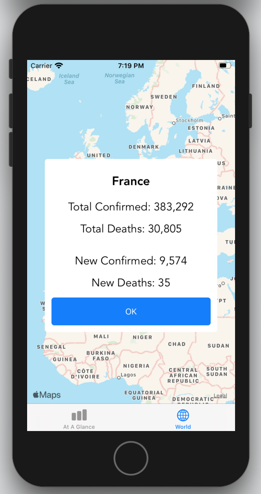

# COVID-19 Tracker

## Get the latest COVID-19 data by country and globally, displayed on an interactive map.

### Features:
* View the total and recent numbers of confirmed cases, deaths, and recoveries globally
* Tap on a country on the map to view its respective statistics
* Data is updated multiple times a day
* Supports dark mode

### Built from scratch with Swift 5 and Xcode 11. No third-party libraries used. Data courtesy of [this API](https://covid19api.com/).

### Screenshots:

